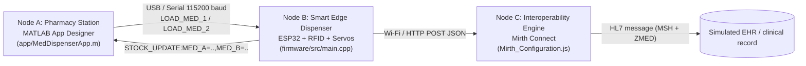

# MedDispenser — Smart Medication Dispensing System

Project developed for the **Application of Medical Technologies in Healthcare** course. The system automates safe medication loading and dispensing through a MATLAB-based pharmacy station, a smart ESP32 dispenser with RFID-based access control, and a clinical interoperability engine (Mirth Connect) that translates device events into HL7-style messaging.

## System Architecture

The system is composed of three nodes that communicate with each other:



### Node A — Pharmacy Station (`app/MedDispenserApp.m`)
A desktop application built with MATLAB App Designer. It has three screens:

- **Login**: simulated operator authentication (`doctor`, `nurse`, or `admin` profiles, demo PIN `1234`).
- **Dashboard**: serial link status with the ESP32 and live inventory telemetry (Compartment A / B).
- **Scanner Module**: uses the PC's webcam to read medication barcodes, translates them into a command (`LOAD_MED_1` or `LOAD_MED_2`), and sends it over the serial port to the ESP32.

### Node B — Smart Edge Dispenser (`firmware/src/main.cpp`)
ESP32 firmware (PlatformIO). It combines two workflows:

- **Loading (via USB/MATLAB)**: receives `LOAD_MED_1` / `LOAD_MED_2`, increments the corresponding internal stock counter, refreshes the LCD/LEDs, and notifies Mirth with a `STOCK_RELOAD` event.
- **Dispensing (via RFID)**: reads an RFID card with the PN532 module and validates that (a) the compartment's stock is not zero and (b) the minimum safety time between doses has elapsed (30 s cooldown per compartment). If valid, it actuates the corresponding servo (opens/closes the compartment) and notifies `DISPENSE_SUCCESS`. Otherwise, it triggers the buzzer and notifies the appropriate error (`ERROR_OUT_OF_STOCK`, `ERROR_COOLDOWN_LOCKOUT`, `ERROR_UNKNOWN_CARD`).

### Node C — Clinical Interoperability Engine (`Mirth_Configuration.js`)
JavaScript transformer for a Mirth Connect channel with an **HTTP Listener** source (port `8081`, path `/api/telemetry`). It receives the JSON payload sent by the ESP32 and maps it into an HL7 v2-style message, populating the `MSH` header (sending system and timestamp) and a custom `ZMED` segment with the event data (status, compartment, UID, stock A, and stock B), simulating a handoff to an EHR.

## Repository Structure

```
.
├── app/
│   └── MedDispenserApp.m       # MATLAB interface (Node A)
├── firmware/
│   ├── src/
│   │   └── main.cpp            # Official ESP32 firmware (Node B) — production build
│   ├── inventory.ino           # Early prototype: LCD + inventory counter
│   ├── RFDI_servo.ino          # Early prototype: RFID reading + servo control
│   └── platformio.ini          # Build configuration (PlatformIO)
└── Mirth_Configuration.js      # Mirth channel transformer (Node C)
```

> **Note:** `inventory.ino` and `RFDI_servo.ino` are the prototyping sketches where the inventory/LCD logic and the RFID/servo logic were validated separately. The final firmware to compile and flash is `firmware/src/main.cpp`, which integrates both pieces plus Wi-Fi and the Mirth notification.

## Required Hardware

- 1x ESP32 Dev Module
- 1x PN532 RFID/NFC reader (I2C)
- 2x servo motors (Compartments A and B)
- 1x 16x2 I2C LCD display (address `0x27`)
- 2x "compartment empty" indicator LEDs
- 1x buzzer
- 2x registered RFID cards/tags (one per compartment)
- USB cable for the link with the PC running MATLAB
- A Wi-Fi network shared between the ESP32 and the PC running Mirth Connect

### Pin Map (`firmware/src/main.cpp`)

| Function                                  | GPIO Pin |
|--------------------------------------------|:--------:|
| Compartment A Servo                         | 25       |
| Compartment B Servo                         | 26       |
| "Compartment A empty" alert LED             | 16       |
| "Compartment B empty" alert LED             | 4        |
| Buzzer (errors / cooldown)                  | 13       |
| I2C SDA (LCD + PN532)                       | 21       |
| I2C SCL (LCD + PN532)                       | 22       |


## Software Requirements

**MATLAB (Node A)**
- MATLAB with App Designer
- Instrument Control Toolbox (for `serialport`)
- MATLAB Support Package for USB Webcams (`webcam`)
- Computer Vision Toolbox (`readBarcode`)

**Firmware (Node B)**
- PlatformIO (VS Code extension or CLI)
- Libraries declared in `platformio.ini`:
  - `Adafruit PN532`
  - `ESP32Servo`
  - `ArduinoJson`
  - `LiquidCrystal_I2C` (marcoschwartz fork)

**Interoperability (Node C)**
- Mirth Connect (local instance)

## Setup and Getting Started

### 1. ESP32 Firmware

1. Open the `firmware/` folder as a PlatformIO project.
2. In `firmware/src/main.cpp`, adjust:
   - `ssid` and `password` to match your Wi-Fi network credentials.
   - `mirthUrl` to point to the IP and port where your Mirth channel runs (default `http://10.42.0.1:8081/api/telemetry/`).
   - The `cardsAuthorized` array with the UIDs of your two RFID cards.
3. Check `platformio.ini`: `upload_port` is hardcoded to `/dev/ttyUSB0` (Linux). On Windows, change it to the matching `COMx` port, or remove the line so PlatformIO auto-detects it.
4. Build and flash the firmware (`pio run --target upload`).
5. Open the serial monitor (115200 baud) to confirm the Wi-Fi connection and the `STOCK_UPDATE:MED_A=...,MED_B=...` message.

### 2. MATLAB Application

1. Open `app/MedDispenserApp.m` in MATLAB and run it (`MedDispenserApp` in the console, or F5).
2. On the **Login** screen, enter a profile (`doctor`, `nurse`, or `admin`) and the PIN `1234`.
3. From the **Dashboard**, press **OPEN SCANNER MODULE**.
4. In the scanner module:
   - Use **REFRESH PORTS** to list available serial ports and select the ESP32's port.
   - Press **LINK INTERFACE** to open the serial connection.
   - Press **START SENSOR** to activate the camera and begin scanning barcodes.
5. When a barcode containing `MED_A`/`1` or `MED_B`/`2` is scanned, the app sends `LOAD_MED_1` or `LOAD_MED_2` to the ESP32, and the dashboard updates with the new stock level.

### 3. Mirth Connect Channel

1. Create a new channel with an **HTTP Listener** source connector:
   - Port: `8081`
   - Context path: `/api/telemetry` (verify it exactly matches `mirthUrl` in the firmware, including or excluding the trailing `/`).
   - Inbound data type: `JSON`.
2. In the **Source Transformer**, add a JavaScript step with the content of `Mirth_Configuration.js`. This step expects the template message to already contain the `MSH` and `ZMED` segments (define them in the channel's template message before running the transformer).
3. Configure the destination of your choice (file writer, database, or another channel) to simulate the EHR receiving the message.

## Communication Protocol

### MATLAB ↔ ESP32 (Serial, 115200 baud, LF terminator)

| Direction       | Message                               | Description                                              |
|-----------------|------------------------------------------|-------------------------------------------------------------|
| MATLAB → ESP32  | `LOAD_MED_1`                           | Requests a reload/increment of Compartment A's stock        |
| MATLAB → ESP32  | `LOAD_MED_2`                           | Requests a reload/increment of Compartment B's stock        |
| ESP32 → MATLAB  | `STOCK_UPDATE:MED_A=<n>,MED_B=<m>`     | Inventory telemetry (sent only when the value changes)      |

### ESP32 → Mirth (HTTP POST JSON to `/api/telemetry`)

```json
{
  "status": "DISPENSE_SUCCESS | STOCK_RELOAD | ERROR_OUT_OF_STOCK | ERROR_UNKNOWN_CARD | ERROR_COOLDOWN_LOCKOUT",
  "compartment": "A | B | NONE",
  "uid": "<RFID UID in hex> | MATLAB_SYS",
  "stockA": 0,
  "stockB": 0
}
```

### Mirth → HL7 (custom `ZMED` segment)

`Mirth_Configuration.js` populates the `MSH` header (sending system `ESP32_DISPENSER` and timestamp) and a `ZMED` segment with the following mapping:

| HL7 Field    | Source (JSON)   |
|--------------|-----------------|
| `ZMED.1`     | `status`        |
| `ZMED.2`     | `compartment`   |
| `ZMED.3`     | `uid`           |
| `ZMED.4`     | `stockA`        |
| `ZMED.5`     | `stockB`        |

## Operating Workflows

**Workflow 1 — Medication Loading (Node A → Node B)**
1. The operator scans the medication's barcode using the PC's camera.
2. MATLAB translates the barcode into `LOAD_MED_1` or `LOAD_MED_2` and sends it over USB.
3. The ESP32 increments the corresponding stock counter, updates the LCD/LEDs, and sends a `STOCK_RELOAD` event to Mirth.
4. MATLAB receives `STOCK_UPDATE:...` and refreshes the Dashboard's telemetry panel.

**Workflow 2 — Patient Dispensing (autonomous on Node B)**
1. The patient taps their RFID card on the PN532 reader.
2. The ESP32 identifies the card and its assigned compartment.
3. It validates, in order: (a) whether the compartment is in *cooldown* (< 30 s since the last dose) → blocks, sounds the buzzer, and sends `ERROR_COOLDOWN_LOCKOUT`; (b) whether stock is 0 → blocks and sends `ERROR_OUT_OF_STOCK`; (c) whether the card is unregistered → sends `ERROR_UNKNOWN_CARD`.
4. If all validations pass, it actuates the servo (opens and closes the compartment), decrements stock, updates the LCD/LEDs, and sends `DISPENSE_SUCCESS` to Mirth.
5. Mirth transforms the event into an HL7 message (`MSH` + `ZMED`), simulating the EHR record.

## Known Limitations & Future Work

- The current firmware no longer sends the `ACK:LOAD_A_OK` / `ACK:LOAD_B_OK` replies that earlier versions used; MATLAB's inventory sync now relies solely on `STOCK_UPDATE:...`, which still works correctly.
- Verify that the Mirth HTTP Listener's configured path exactly matches `mirthUrl` (including or excluding the trailing slash) to avoid `404` responses.
- `inventory.ino` and `RFDI_servo.ino` remain as historical reference for the modular development process; they are not part of the production build.
